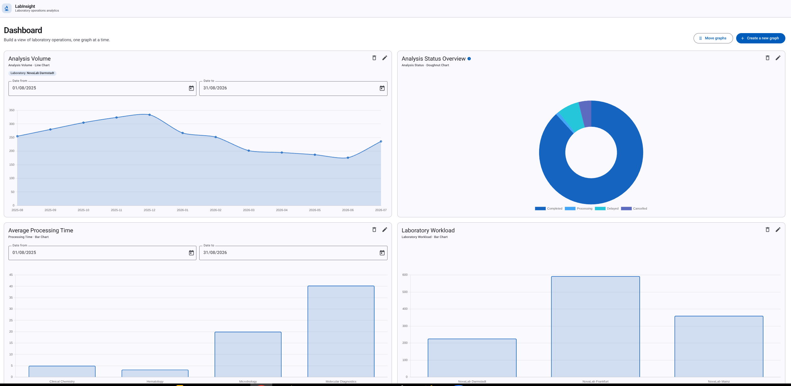

# LabInsight

**Configurable Laboratory Operations Analytics Dashboard**

LabInsight is a full-stack web application for exploring and visualizing laboratory operations data. Users can create and configure their own analytics widgets, choose different metrics and visualization types, apply filters, and organize the dashboard according to their analytical needs.

All data used by LabInsight is synthetically generated. The application does not contain or represent real patient or medical data.

## Live Demo

**[Open LabInsight Live Demo](https://lab-insight-etorella.vercel.app/dashboard)**

The live application is deployed with:

- Angular frontend on Vercel
- ASP.NET Core Web API on Render
- PostgreSQL database on Neon

**N.B.** The first visit after idle time may take about a minute while the API starts. After that, the dashboard loads normally.



## Overview

LabInsight provides a configurable dashboard for monitoring fictional laboratory operations. The layout is not a fixed set of charts: each widget is a saved graph item with its own metric, visualization, filters, and order on the page.

The frontend renders those widgets. Filtering and aggregation run on the backend, which returns prepared series (and, for some metrics, table rows) for the selected graph.

## Features

- Configurable dashboard of user-created analytics widgets
- Four-step create/edit wizard (data type, visualization, configuration, review)
- Visualizations: line chart, bar chart, pie chart, doughnut chart, and data grid (availability depends on the selected metric)
- Optional filters: laboratory, analysis category, priority, and status (where the metric supports them)
- Optional date range for Analysis Volume, Processing Time, and Completion Rate (empty dates default to the last 12 months on the server)
- Optional grouping by day, week, or month for Analysis Volume and Processing Time
- Applied laboratory, category, priority, and status filters shown on the widget when set
- Optional graph description, shown from an info icon on hover
- Edit and delete widgets
- Drag-and-drop reorder, then save the new order
- Persistent widget configuration (`GraphItem` plus JSON content)
- Server-side analytics over a synthetic laboratory dataset

## Available Analytics

| Metric | What it shows |
| --- | --- |
| Analysis Volume | Number of analyses received over time |
| Analysis Status | Distribution of analyses by operational status |
| Processing Time | Average laboratory processing duration |
| Analysis Category | Distribution of analyses across categories |
| Laboratory Workload | Current workload across laboratories |
| Priority Distribution | Share of Normal, High, and Urgent analyses |
| Completion Rate | Ratio of completed analyses to all analyses |
| Delayed Analyses | Analyses that exceed expected processing time |

Not every visualization is offered for every metric. Compatible chart types are selected in the wizard after the metric.

## Configurable Dashboard

Creating or editing a graph uses four steps:

1. **Select Data** — choose the metric (`GraphDataType`)
2. **Select Graph Type** — choose how to draw it (`GraphType`), from the types allowed for that metric
3. **Configure** — name, optional description, and optional filters
4. **Review & Create** — confirm, then save (or save changes when editing)

`GraphDataType` is **what** is calculated. `GraphType` is **how** it is visualized. For example, Analysis Volume can be a line chart, bar chart, or data grid.

Each widget stores its configuration and is loaded independently. Date-capable widgets can change Date from / Date to on the card; that update is saved and the series is recalculated on the server.

## Architecture

```
Angular
   ↓
ASP.NET Core Web API
   ↓
Entity Framework Core
   ↓
PostgreSQL
```

The UI does not filter raw analysis rows in the browser for these graphs. It calls `GET /api/getGraphItemData/{id}`. The API reads that item’s saved content, applies filters in EF Core, aggregates, and returns points (and unit labels) ready to plot.

## Technology Stack

### Frontend

- Angular 21
- TypeScript
- Angular Material and Angular CDK
- Chart.js with ng2-charts
- RxJS

### Backend

- ASP.NET Core (`net10.0`)
- C#
- Entity Framework Core 10 with Npgsql
- REST API (Swagger UI in Development)

### Database

- PostgreSQL 16 (Compose service in this repository)

## Synthetic Dataset

On first API start, the backend applies migrations and seeds catalog data plus **15,000** synthetic `LabAnalysis` records (deterministic seed). If no graphs exist yet, it also creates four example widgets.

The seed includes:

- Fictional laboratories (NovaLab Frankfurt, Mainz, and Darmstadt)
- Analysis categories (Hematology, Clinical Chemistry, Microbiology, Molecular Diagnostics)
- Received, started, and completed timestamps
- Status and priority
- Processing timelines derived from category expected duration

There is no real patient or medical data.

## Project Purpose

LabInsight is a portfolio project for a configurable, data-intensive full-stack business application. It focuses on Angular feature structure and reusable widgets, a wizard that composes metric + visualization + filters, Chart.js views over API-prepared series, an ASP.NET Core REST API, and EF Core/PostgreSQL for persistence and server-side aggregation.

## Running Locally

**Prerequisites:** Node.js 20+, npm, .NET SDK 10, and Docker or Podman with Compose.

### 1. Database

From the repository root:

```bash
docker compose up -d
```

PostgreSQL listens on `localhost:5432`. Database name: `labinsight`.

Local Compose defaults are in `.env.example`. Copy that file to `.env` only if you need to override them. The API’s Development connection string is in `backend/appsettings.Development.json`. Do not use these values in production.

### 2. API

From `backend/`:

```bash
dotnet run --launch-profile http
```

Startup runs pending EF Core migrations and seeding. Optional, if you use the `dotnet-ef` tool from `dotnet-tools.json`:

```bash
dotnet ef database update --project LabInsight.Api.csproj
```

- API: [http://localhost:5080](http://localhost:5080)
- Swagger (Development): [http://localhost:5080/swagger](http://localhost:5080/swagger)

### 3. Frontend

From `frontend/`:

```bash
npm install
npm start
```

App: [http://localhost:4200](http://localhost:4200)

The Angular client calls `http://localhost:5080` (`frontend/src/environments/environment.ts`).
